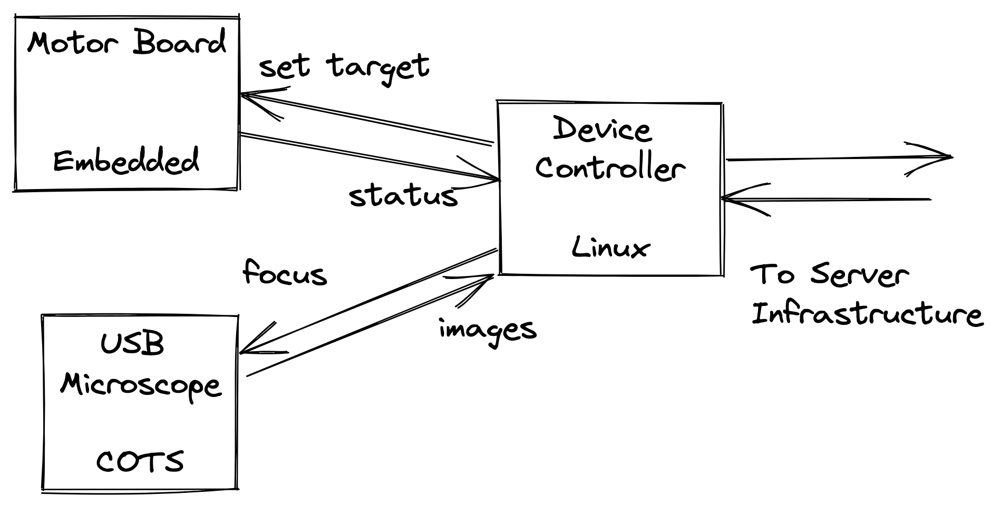

# Passaging

  David Laban
   
  31 Oct 2022

---

# Outline

- ...

- Questions

---

# Problem Statement

Perform passaging, when conditions are met:

* Take images of flask periodically.
* Wait for a condition to be met.
* Move cells to new flask.

User may review images and delay passaging at any point.

---

# Failure Modes

* User is unresponsive:
  * Continue with the passaging.
  * Alert the user.
* Network Outage:
  * Continue with the passaging.
  * Alert the user.

Keep Trucking On.

---

# High Level Architecture

---

# Passaging Device

---

# Server Infrastructure - Distributed Monolith

---

# ...

---

# Questions?

---

# Appendix: Assumptions

* Cells move slowly
  * Low frame rate
  * Okay to upload every photo to S3.
* Microscope can autofocus with simple max-sharpness algorithm

---

# Appendix: Fail-Safe Behaviour

* What should the behaviour be if the user is unresponsive?
  * Probably continue with the passaging?
  * Alert the user that this is what you've done?
* What should the behaviour be if the server is unreachable?
  * Probably continue with the passaging?
  * Alert the user that the device is unavailable.

---

# Appendix: Wardley Map

