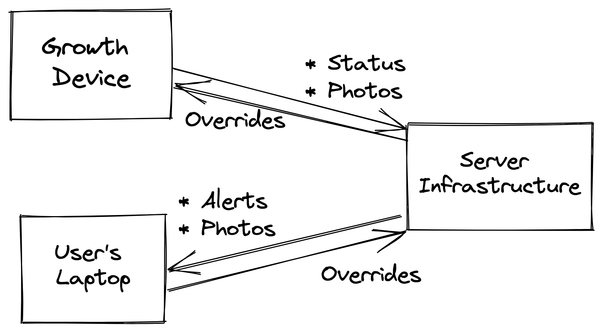

# Passaging

  David Laban
   
  31 Oct 2022

---

# Outline

- ...

- Questions

---

# Problem

Perform passaging, but only at the right time:

* Wait for a preset delay.
* Take images of flask.
* Ask for user approval:
  * Move cells to new flask.
  * Wait some more.

---

# Alternative Problem Statement

Perform passaging, when conditions are met:

* Take images of flask periodically.
* Wait for a condition to be met.
* Move cells to new flask.

User may review images and delay passaging at any point.

---

# High Level Architecture

---

# ...

---

# Questions?

---

# Appendix: Fail-Safe Behavior

* What should the behavior be if the user is unresponsive?
  * Probably continue with the passaging?
  * Alert the user that this is what you've done?
* What should the behavior be if the server is unreachable?
  * Probably continue with the passaging?
  * Alert the user that the device is unavailable.
