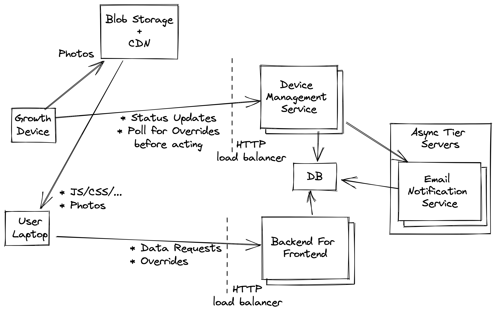
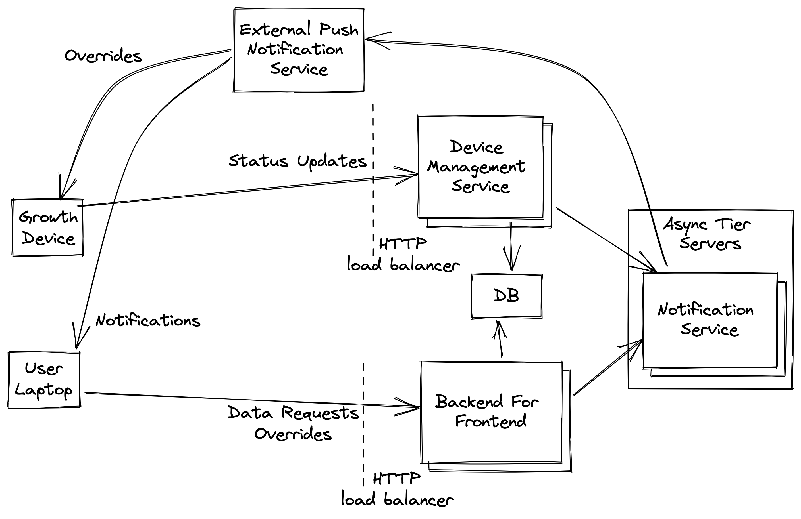

# Passaging

  David Laban
   
  31 Oct 2022

---

# Outline

- ...

- Questions

---

# Problem Statement

Perform passaging, when conditions are met:

* Take images of flask periodically.
* Wait for a condition to be met.
* Move cells to new flask.

User may review images and delay passaging at any point.

---

# Failure Modes

* User is unresponsive:
  * Continue with the passaging.
  * Alert the user.
* Network Outage:
  * Continue with the passaging.
  * Alert the user.

???

Keep Trucking On.

---

# High Level Architecture

???

* Nothing to see here. This is just a map of the landscape.
* Look into each piece separately.

---

# Growth Device

???

* Needs to be autonomous
  * Microscope Focus logic lives here
  * Confluence Estimation logic lives here
  * Cell liveness estimation logic lives here
  * User-provided strategy logic lives here
* Motors control everything: pumps, flask selection, (centrifuges?)
  * Motor control wants to be on its own RTOS
  * Talked to Henry about protocol if language is same on both sides.
  * Otherwise, define in protobuf/similar, and bind into both languages.
  * Add checksums, and fuzz round-trip-ability of messagses in CI.
* Pick commodity-off-the-shelf microscopes
  * Focussing is the only thing that wants to be real-time.
    * Simple maximum-sharpness algorithm would be enough for this.
    * Could be built into the microscope?

---

# High Level Architecture Recap

???

* Flash this up
* Talk about Server Architecture Next

---

# Server Infrastructure - Distributed Monolith

---

# Server Infrastructure - Push Based

???

* I know that they are using MQTT. Why?
  * Immediate control of device from laptop/tablet?
  * Efficiency doesn't feel like the driving factor.
* External push service - infrastructure.
  * Pubsub topics/channel(s) per device
  * Pubsub topics/channel(s) per user
  * Can often hang email/sms off the push service.

---

# Server Infrastructure - Message Broker

* Dashed lines depict that everything is connected to the message broker
  * Broker could be MQTT or NATS or similar
  * Physical topology not as important as logical message flow.
  * Care has to be taken around Access Control:
    * Devices+Laptops should only be able to subscribe to topics from the same org
    * 
* Logical message flow can be more direct.
* Broker handles message fan-out and load balancing.
* Broker stores messages for clients that are offline if desired.
* Brokers typically have message size limits, so GraphQL is still a good idea.
* Not Shown:
  * Auth Service for bootstrapping Device and Laptop
  * Blob Storage for images.

---

# ...

---

# Questions?

---

# Appendix: Assumptions

* Cells move slowly
  * Low frame rate
  * Okay to upload every photo to S3.
* Microscope can autofocus with simple max-sharpness algorithm
* Linux board is pretty powerful
  * Can handle HTTP+SSL just fine
* Fleet size is small-ish (risky)
  * HTTP polling is just fine

---

# Appendix: Fail-Safe Behaviour

* What should the behaviour be if the user is unresponsive?
  * Probably continue with the passaging?
  * Alert the user that this is what you've done?
* What should the behaviour be if the server is unreachable?
  * Probably continue with the passaging?
  * Alert the user that the device is unavailable.

---

# Appendix: Wardley Map

???

TODO: add server racks - should not be bespoke

---

# Appendix: Personal Notes

* [Video: Passaging Cells: Cell Culture Basics](https://www.youtube.com/watch?v=CMRKKl9XSDU)

---

# Appendix: Cell Review UI

---

# Appendix: Dashboard UI

---

# Device Enrolment

* TODO

???

* Provide wifi creds via hotspot dance || require wired connection
  * Better to require wired connection for large installs
* Device doesn't seem to have a screen:
  * Indicator LEDs for "please feed me"?
  * ID printed on the front, or QR code somewhere?
